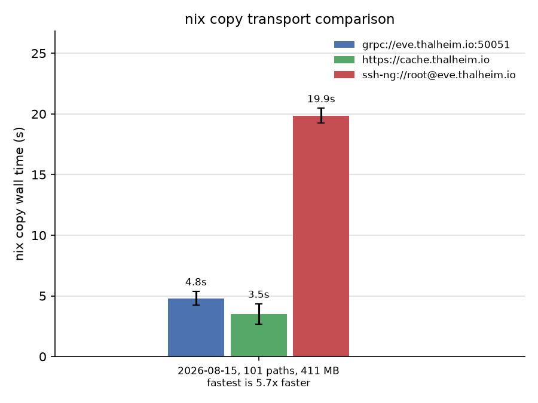
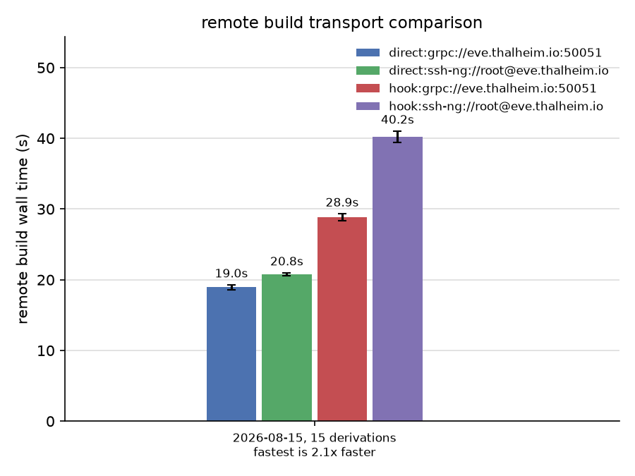

# nix-grpc-store

**Status: Beta.** Safe to use but interfaces may change, so you will need to keep server/client in sync.

Remote Nix store access over gRPC instead of SSH. `nix copy` over a WAN
link is **4.3x faster than `ssh-ng://`** because round trips are hidden:
path-info queries are batched and NAR downloads are pipelined, so wall time
is bandwidth-bound instead of latency-bound.

Why gRPC instead of `ssh-ng://`?

  * **Latency-tolerant `nix copy`.** Dedicated streaming RPCs batch path
    queries and keep up to 64 NAR requests in flight. Copying 200 small
    paths at 50 ms RTT takes 1.3 s instead of the 11.8 s a
    round-trip-per-path client needs.
  * **Faster handshakes.** A TLS handshake is much cheaper than an SSH
    connection setup (no subprocess, no shell, no SSH key exchange and
    session negotiation), and connections are multiplexed over HTTP/2, so
    frequent short-lived store operations start quickly.
  * **Standard TLS certificates.** Authentication uses plain X.509 certs
    instead of SSH keys, so you can plug into existing PKI — for example a
    [step-ca](https://smallstep.com/docs/step-ca/) issuing short-lived client
    and server certs — and reuse load balancers, service meshes and mTLS
    policies that already speak HTTP/2.
  * **Compression.** All traffic is zstd-compressed. A whole batch of
    paths shares a single zstd stream (one compression window across all
    NARs), unlike ssh's optional zlib, which made the benchmark below
    slower instead of faster.

Everything that works over `ssh-ng://` works here: remote builds,
`nix copy`, path queries, GC. The gRPC layer is a thin tunnel to the
`nix-daemon` on the other side, with dedicated RPCs for the `nix copy` hot
path (path info queries, bulk import, NAR download).

## Benchmark

`nix copy` of a 101-path, 411 MB closure from the same server over a
wired link with ~47 ms RTT, 10 interleaved runs each.

A static HTTP binary cache stays ahead for pure downloads, but it is
download-only. The gRPC store keeps close while also handling uploads,
remote builds, GC and mTLS through the same endpoint.

Reproduce with `./scripts/bench-transports.py`.

Remote builds skip the tunnelled worker protocol too: one streaming RPC
submits the derivation and returns the result with its output path
infos, so a chain of tiny builds over a ~50 ms WAN link runs 2.6x
faster than `ssh-ng://`:

Reproduce with `./scripts/bench-builds.py`.

## Install

    nix build

This produces `result/bin/nix-grpc-daemon` for the server and
`result/lib/nix/plugins/nix-grpc-store-loader.so` for the client, which
dispatches to the plugin build matching the running Nix version.

## Quick start (NixOS)

Add the flake and enable the modules:

    # flake.nix inputs
    nix-grpc-store.url = "github:Mic92/nix-grpc-store";

    # server
    imports = [ nix-grpc-store.nixosModules.server ];
    services.nix-grpc-daemon.enable = true;
    services.nix-grpc-daemon.tls = { certFile = ./server.pem; keyFile = ./server.key; };

    # client
    imports = [ nix-grpc-store.nixosModules.client ];
    programs.nix-grpc-store.enable = true;

The client module ships plugin builds for the supported Nix versions and a
loader that picks the one matching the running Nix. The server module runs
the daemon as an unprivileged `nix-grpc-daemon` user and adds it to
`extra-allowed-users` so it can reach the local `nix-daemon` even when
`allowed-users` is restricted.

## Trust model

gRPC clients act as the `nix-grpc-daemon` user, which is not trusted by
default. That is enough for `nix build --store 'grpc://…'`, `nix copy`,
path queries and GC: sources and derivations are content-addressed, signed
cache paths are accepted, and the server builds everything itself.

This makes an untrusting server usable as a builder without any special
setup:

    nix build nixpkgs#hello --store 'grpc://builder:50051' --eval-store auto

Evaluation runs locally (`--eval-store auto` keeps the eval artifacts in
the local store instead of round-tripping them to the server), the
derivation closure is imported — sources and `.drv` files are
content-addressed, so they pass signature checks — and all builds happen
server-side. Nothing unsigned crosses the trust boundary, so
`trustClients` can stay off.

Using the server as a remote builder (`builders = grpc://…`) is different:
there the *client* schedules builds and uploads input paths it built
locally, which are unsigned — something only trusted users may do. Set
`services.nix-grpc-daemon.trustClients = true` for that. Every
authenticated client then has trusted-user privileges, so require client
certs (`tls.clientCaFile`).

## Remote builder

    nix.buildMachines = [{
      hostName = "grpc://builder:50051";
      protocol = null;
      systems = [ "x86_64-linux" "aarch64-linux" ];
      maxJobs = 64;
    }];

TLS uses the system CA bundle and the client key pair from
`/run/nix-grpc-store` or `/var/lib/nix-grpc-store` by default (see below).

With access control enabled, remote builders need the `trusted` role.
The builder protocol imports unsigned outputs built on the client, which
also requires `trustClients` (see above). Clients that only build *on*
the server (`nix build --store 'grpc://…'`) submit builds through a
dedicated RPC and get by with `write`. `nix copy --to` needs `write` as
well, and substituter/`nix copy --from` access only needs `read-only`.

## Quick start (manual)

On the builder:

    nix-grpc-daemon --listen 0.0.0.0:50051

On the client, add to `nix.conf`:

    plugin-files = /path/to/lib/nix/plugins

and use it like any other store URI:

    nix store info --store 'grpc://builder:50051?insecure=1'
    nix build nixpkgs#hello --store 'grpc://builder:50051?insecure=1'
    nix copy --to 'grpc://builder:50051?insecure=1' ./result

The daemon proxies to the local `nix-daemon` socket, so gRPC clients get
whatever store privileges the uid running `nix-grpc-daemon` has.

## TLS and mTLS

Server:

    nix-grpc-daemon --listen 0.0.0.0:50051 \
        --tls-cert server.pem --tls-key server.key \
        --client-ca ca.pem              # optional: require client certs

Client:

    nix build --store \
      'grpc://builder:50051?ca-cert=ca.pem&client-cert=me.pem&client-key=me.key' ...

Without `--client-ca` any TLS client can connect. With it, only clients
presenting a certificate signed by that CA are accepted.

## Access control

With mTLS, `--allow 'cn-pattern=role'` maps client certificate CNs to
roles via glob patterns. The first match wins and unmatched clients are
denied. Without any rules every authenticated client keeps full access.

    nix-grpc-daemon ... --client-ca ca.pem \
        --allow 'ci-*=trusted' \
        --allow 'cache-mirror=read-only' \
        --allow '*=write' \
        --allow-anonymous read-only    # optional: cert-less clients

  * `read-only` — path queries and NAR downloads (`nix copy --from`)
  * `write` — additionally imports (signature checking is enforced
    regardless of `--no-check-sigs`) and server-side builds
    (`nix build --store 'grpc://…'`)
  * `trusted` — everything, including the raw worker-protocol tunnel
    (GC, `nix store add`, repair) and unsigned imports (still subject to
    the nix-daemon's trust in the proxy user, see above)

`--allow-anonymous ROLE` relaxes the client-certificate requirement:
cert-less clients connect with that role (e.g. a public read-only
cache), certificate holders keep their `--allow` roles. Naming policies
pair well with a CA like [step-ca](https://smallstep.com/docs/step-ca/),
where provisioners constrain which CNs each token may request.

NixOS:

    services.nix-grpc-daemon.accessRules = [
      { cn = "ci-*"; role = "trusted"; }
      { cn = "*"; role = "read-only"; }
    ];
    services.nix-grpc-daemon.anonymousRole = "read-only"; # optional

Role needed per use case:

| Use case                                         | Role        |
| ------------------------------------------------ | ----------- |
| Substituter, `nix copy --from`                   | `read-only` |
| `nix copy --to` (signed paths)                   | `write`     |
| `nix build --store 'grpc://…' --eval-store auto` | `write`     |
| Remote builder (`nix.buildMachines`)             | `trusted`   |
| GC, `--repair`, `nix store add`                  | `trusted`   |

Builds are submitted through a dedicated RPC and run entirely
server-side, so the `write` role suffices. Only operations that tunnel
the raw worker protocol need `trusted`, and repair builds are treated
like the rest of the repair surface.

For host-based access, pair this with a CA that issues certs with the
host's domain name in the CN, e.g. a
[step-ca](https://smallstep.com/docs/step-ca/) ACME provisioner with
`forceCN = true`: each host obtains its certificate via ordinary ACME
(`security.acme`) and an `accessRules` glob like `*.example.com =
read-only` grants it substituter access. See
[`tests/acme-substituter-test.nix`](tests/acme-substituter-test.nix)
for a complete, tested NixOS setup (built as the `acme-vm` check).

## URI parameters

  * `insecure` — plaintext, no TLS (testing only)
  * `ca-cert` — PEM CA to verify the server. Defaults to `$NIX_SSL_CERT_FILE`,
    `$SSL_CERT_FILE` or the system CA bundle
  * `client-cert`, `client-key` — PEM pair to present for mTLS. Default to
    `$NIX_GRPC_CLIENT_CERT`/`$NIX_GRPC_CLIENT_KEY`, then `client.crt`/`client.key`
    in `$XDG_DATA_HOME/nix-grpc-store`, then `/run/nix-grpc-store`, then
    `/var/lib/nix-grpc-store` (unreadable candidates are skipped)

## Server flags

  * `--listen ADDR` — default `0.0.0.0:50051`
  * `--proxy-socket PATH` — nix-daemon socket, default `/nix/var/nix/daemon-socket/socket`
  * `--tls-cert`, `--tls-key`, `--client-ca` — see above
  * `--allow 'cn-pattern=role'`, `--allow-anonymous ROLE` — see access control
  * `--metrics-listen ADDR` — serve Prometheus metrics, disabled if unset
  * `--log-level info|debug` — access log verbosity, default `info`

## Monitoring

All gRPC clients act as the same local user, so activity is attributed to the
client certificate CN (`cn=-` without mTLS). Have your CA put a user name in
the CN and logs and metrics are per user.

### Access log

The daemon writes one logfmt line per RPC to stderr (journald):

    ts=2025-01-15T12:03:41Z level=info event=session_end method=Connect cn=alice peer=ipv4:10.0.0.5:53211 duration_s=1832 bytes_in=52341 bytes_out=812345678

| event | logged for | extra fields |
|---|---|---|
| `session_end` | finished tunnel sessions | duration, uncompressed bytes in/out |
| `rpc` | bulk transfers | path count, duration, NAR bytes |
| `session_start`, path queries | only at `--log-level debug` | |

Every line carries the client certificate CN and the peer address, so one
user's activity is a grep away:

    journalctl -u nix-grpc-daemon | grep cn=alice

### Prometheus metrics

With `--metrics-listen 127.0.0.1:9464` (NixOS:
`services.nix-grpc-daemon.metricsListen`) the daemon serves `/metrics`:

| metric | labels | counts |
|---|---|---|
| `nix_grpc_rpcs_total` | method, cn | RPCs handled |
| `nix_grpc_tunnel_bytes_total` | direction, cn | uncompressed tunnel bytes |
| `nix_grpc_nar_bytes_total` | direction, cn | uncompressed NAR bytes imported/exported |

Only CA-issued CNs appear as labels, so cardinality stays bounded.

## Tests

    nix build .#checks.x86_64-linux.vm -L

End-to-end NixOS VM test plus a 256 MiB throughput benchmark against the unix
socket and `perf` counters. See `src/pump.hh` for design notes on chunk
coalescing and flushable zstd.

    nix build .#bench-latency -L

VM benchmark measuring `nix copy` of 200 small paths at an emulated 50 ms
RTT. `scripts/bench-transports.py` benchmarks real hosts across transports
and `scripts/bench-plot.py` renders the chart above.
