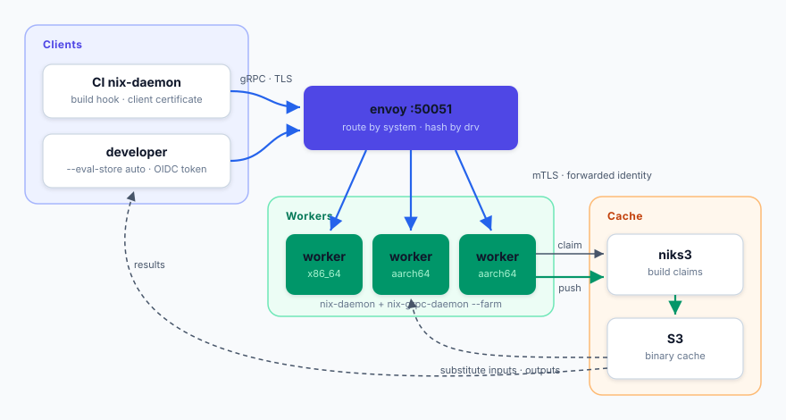

# Set up a build farm

A build farm is a group of workers behind one address. Clients send
builds to that address, each derivation is built once even if several
clients ask for it, work spreads over all workers, and outputs land in an
S3 binary cache through [niks3](https://github.com/Mic92/niks3).



This guide walks you through setting up the cache, the workers, the
balancer, and two kinds of client: a CI host and a developer laptop, on
NixOS. For the Helm chart see [kubernetes.md](kubernetes.md).

## How it works

Every node runs the same `nix-grpc-daemon` and has one or both of two
roles:

* A **builder** runs builds.
* The **scheduler** keeps the queue and decides which builder runs
  what. One scheduler is active at a time.

On a handful of fixed machines, give one or two of the builders the
scheduler role as well. When builders come and go with an autoscaler,
run the scheduler role on two or three small fixed nodes of its own
instead. The defaults, both roles and no other nodes configured, give
you a standalone machine that schedules onto itself.

What happens on a build:

* The client opens one connection to the scheduler and lists the
  derivations it wants. For each one the scheduler answers *cached*
  (outputs are already in the binary cache), *go to builder X*, or *no
  builder can take this* (wrong system or missing feature). Derivations
  on the longest chain go first, and among builders with a free slot
  the one that already has the inputs wins.
* Each builder keeps a connection to the scheduler open that says which
  system and features it offers and how many builds it takes. The
  scheduler tells it which derivation to expect before the client shows
  up. A build nobody announced is turned away and the client asks the
  scheduler again. A second client for a build that is already running
  attaches to it.
* The balancer (envoy) sends scheduler traffic to the active scheduler,
  sends each build to the builder the scheduler named, and spreads
  everything else (uploads, queries, downloads) over the builders of
  the right system.

The scheduler keeps nothing on disk. When it restarts, running builds
carry on, builders and clients reconnect, and clients ask again for
what is still missing. A clean stop tells them first, so they come back
at once and print nothing. After a crash they notice on their own and
keep trying for two minutes. Should a client ask again before the
builder already working on its derivation has reconnected, a second
builder may start it too. As soon as the first one reports in, the
scheduler stops the second and points the clients at the first, so only
one set of outputs ever exists.

With several scheduler-role nodes, niks3 decides which one is active:
the first to take a lock in its database, for as long as it stays
connected. When it goes away another node has the lock within seconds.

When a builder restarts, its builds fail and the scheduler sends them
elsewhere.

## Before you begin

You need:

* A [niks3](https://github.com/Mic92/niks3) instance, an S3 bucket behind
  it, and its API token and public signing key. A single node can do
  without. Outputs then stay in its store.
* One or more NixOS machines per system type as builders, and the
  scheduler role on one or two of them or on separate small machines.
* One machine with a public DNS name for the balancer. It can also be a
  worker.
* A small private CA. It signs three kinds of certificate:

  | Certificate | CN | Used by |
  |---|---|---|
  | client cert | `ci-<host>` | each CI host, towards the balancer |
  | node cert | `worker-<host>`, SAN = address envoy dials | each node as its server cert, and as its client cert towards the scheduler |
  | balancer cert | `lb-<host>` | envoy, towards the nodes |

  The client cert is the same as for a standalone `nix-grpc-daemon`,
  so existing ones keep working. The other two cover the hops the
  balancer adds: envoy terminates the client's TLS and passes the
  client's identity on in a header, and the nodes only believe that
  header from a peer with a balancer cert (`trustedProxies`). The
  balancer's public listener uses a regular ACME certificate, so
  clients don't need the private CA. Nodes that reach the scheduler
  through that listener accept it too, they check the scheduler against
  the private CA and the system CA bundle.

All modules below come from `nix-grpc-store.nixosModules.default`.

## Step 1: Configure the nodes

```nix
services.nix-grpc-daemon = {
  enable = true;
  listen = "[::]:50052";
  advertise = "10.0.0.5:50052";
  roles = [ "builder" ];              # [ "builder" "scheduler" ] on the scheduler node
  scheduler = "10.0.0.4:50052";       # leave out on the scheduler node itself
  idleTimeout = null;
  minFree = "20G";
  tls = {
    certFile = "/run/keys/worker.crt";
    keyFile = "/run/keys/worker.key";
    clientCaFile = "/run/keys/farm-ca.crt";
  };
  trustedProxies = [ "lb-*" ];
  accessRules = [
    { cn = "ci-*"; role = "trusted"; }
    { cn = "worker-*"; role = "trusted"; }
  ];
  niks3 = {
    url = "https://niks3.example.com";
    tokenFile = "/run/keys/niks3-token";
    cacheUrl = "https://cache.example.com";
    publicKeys = [ "cache.example.com-1:…" ];
  };
};
```

| Option | Meaning |
|---|---|
| `roles` | `builder`, `scheduler` or both (the default). Only fixed machines should have `scheduler`. |
| `scheduler` | Where a builder finds the scheduler: that node's address, or the balancer's when several nodes have the role (see [failover](#managing-the-farm)). Unset on a node that is the only scheduler. |
| `advertise` | The address the balancer knows this node by. Must match its entry in the balancer's `workers` or `scheduler`. |
| `maxJobs` | Concurrent builds. Defaults to the local nix-daemon's `max-jobs`. |
| `minFree` | Below this much free disk the node takes no new builds until space returns. |
| `trustedProxies` | Peers with a matching client cert are balancers. The node takes the real client identity from the `x-forwarded-client-cert` header they set. Other peers can't set it. |
| `accessRules` | Maps CNs to roles. CI needs `trusted`, and so do the other nodes for their connection to the scheduler. |
| `schedulerTokenFile` | Bearer token for the connection to the scheduler, instead of or next to the client certificate. The scheduler node maps it to `trusted` through its `oidc` rules. |
| `niks3.tokenFile`, `niks3.clientCertFile` | How the node authenticates to niks3: a bearer token, a client certificate (defaults to `tls.certFile`), or both. |
| `workerName` | Name clients see in `worker: building …` lines and in `nix_grpc_build_info`. Defaults to the hostname. |

Repeat for every node. Builders for different systems use the same
config. `nix.settings.system-features` decides which
`requiredSystemFeatures` a builder accepts: a derivation that needs
`kvm` only goes to builders that list it. A builder with
`nix.settings.extra-platforms` (binfmt, Rosetta) takes those systems
too. List it under each of them in the balancer's `workers`. A
scheduler-only node is the same with `roles = [ "scheduler" ]` and no
`scheduler`, `maxJobs` or `minFree`.

A node has two outbound connections, to the scheduler and to niks3, and
on each it can present its certificate, a bearer token, or both. With
the config above it is the certificate on both, plus the niks3 API token.
A farm without its own CA gives every node an OIDC token for each
instead (`schedulerTokenFile`, `niks3.tokenFile`) and the scheduler node an
`oidc` rule that grants those tokens `trusted`. When a certificate and a
token are both presented, the certificate decides. `scheduler` uses TLS
unless written as `http://host:port`.

Builds run in `nix-daemon.service`, RPCs and downloads in
`nix-grpc-daemon.service`. Give both a `CPUWeight`/`MemoryHigh` so a
heavy build can't starve the daemon.

### Optional: accept developer tokens

To let people without a client certificate use the farm, add an OIDC
provider. The schema matches niks3's `--oidc-config`.

```nix
services.nix-grpc-daemon.oidc.providers.sso = {
  issuer = "https://auth.example.com/realms/internal";
  audience = "nix-farm";
  rules = [ { bound_claims.groups = [ "developers" ]; scopes = [ "write" ]; } ];
};
```

`write` lets a token holder request builds. It does not let them upload
unsigned paths or open the worker-protocol tunnel.

## Step 2: Configure the balancer

```nix
services.nix-grpc-farm-lb = {
  enable = true;
  listen = "[::]:50051";
  workers = {
    x86_64-linux  = [ "10.0.0.4:50052" ];
    aarch64-linux = [ "10.0.0.5:50052" "10.0.0.6:50052" ];
  };
  scheduler = "10.0.0.4:50052";
  tls = {
    certFile = "/var/lib/acme/farm.example.com/fullchain.pem";
    keyFile  = "/var/lib/acme/farm.example.com/key.pem";
    clientCaFile = "/run/keys/farm-ca.crt";
    upstream = {
      certFile = "/run/keys/lb.crt";
      keyFile  = "/run/keys/lb.key";
      caFile   = "/run/keys/farm-ca.crt";
    };
  };
};
security.acme.certs."farm.example.com".group = "envoy";
```

Renewed certificates are picked up from disk without a restart, on the
balancer as well as on workers and scheduler.

| Option | Meaning |
|---|---|
| `workers` | Builder addresses per system, as in their `advertise`. Requests for a system not listed go to `defaultSystem` (first entry by default). |
| `scheduler` | The node(s) with the `scheduler` role, as in their `advertise`. With several, envoy routes to the active one. Defaults to the first entry of `workers.<defaultSystem>`. |
| `tls.certFile`/`keyFile` | Public server certificate. |
| `tls.clientCaFile` | Verify client certificates against this CA and forward the subject to workers. Clients without a certificate are still accepted so tokens work. |
| `tls.upstream.*` | The certificate envoy presents to workers, and the CA to verify them. |

To check that envoy sees your workers:

```console
$ curl -s localhost:9901/clusters | grep health_flags
x86_64-linux::10.0.0.4:50052::health_flags::healthy
aarch64-linux::10.0.0.5:50052::health_flags::healthy
sched::10.0.0.4:50052::health_flags::healthy
```

`accessLog = true` adds one journal line per connection with the client
certificate subject and, for failed TLS handshakes, the reason.

## Step 3: Connect a CI host

The CI host's nix-daemon uses the farm through the standard build hook.

```nix
programs.nix-grpc-store.enable = true;
nix.distributedBuilds = true;
nix.buildMachines = map (system: {
  hostName = "grpc://farm.example.com:50051?system=${system}&client-cert=/run/keys/ci.crt&client-key=/run/keys/ci.key";
  protocol = null;
  inherit system;
  supportedFeatures = [ "big-parallel" "kvm" "nixos-test" ];
  maxJobs = 64;
}) [ "x86_64-linux" "aarch64-linux" ];
```

Use one `buildMachines` entry per system. The `system=` parameter tells
the balancer which builders should receive the inputs the hook uploads
before the build, and which ones serve `builders-use-substitutes`
downloads.

The CI certificate needs the `trusted` role, since the hook uploads
locally built, unsigned store paths.

If `nix.firewall` restricts what `nix-daemon.service` may connect to,
port 50051 is already allowed. For a balancer on another port set
`programs.nix-grpc-store.daemonEgressPorts`.

To verify, build something that isn't cached:

```console
$ nix build --max-jobs 0 --impure --expr '(import <nixpkgs> {}).runCommand "farm-test" {} "date > $out"'
building '/nix/store/…-farm-test.drv' on 'grpc://farm.example.com:50051?…'...
worker-1: building …-farm-test.drv
```

## Step 4: Connect a developer laptop

Developers authenticate with a token instead of a certificate and
evaluate locally:

```console
$ nix build --store 'grpc://farm.example.com:50051?token-file=./jwt' --eval-store auto .#pkg
```

`--eval-store auto` keeps evaluation and the `.drv` files on the
laptop. Nix hands the whole dependency graph to the farm in one go, so
independent derivations build on different builders in parallel.

The outputs end up in the cache, not in the local store. To fetch them:

```console
$ nix copy --from https://cache.example.com $(nix build … --print-out-paths)
```

A small wrapper script that fetches the token (an OIDC device-code
login is a few lines of `curl`) and runs `nix build` makes this a
one-liner for the team, e.g. `nix run .#nix-farm`.

## Managing the farm

**Add a builder.** Deploy it with the Step 1 config, add its address
under `workers.<system>`, redeploy the balancer. It takes queued builds
as soon as it has connected to the scheduler.

**Autoscale builders.** `nix_grpc_sched_system` has one series per
system and feature set. `queued`, `unplaceable` and `running` are
labelled with what the derivations require (`features=""` for none,
otherwise sorted and comma-joined like `features="big-parallel,kvm"`).
`slots` and `free` are labelled with what the builders offer, under
their native system. So a plain x86_64 group scales on
`{system="x86_64-linux",features=""}` and a kvm group on
`{system="x86_64-linux",features="kvm"}` independently. `unplaceable`
counts queued builds that no connected builder could take at all, so a
group does not grow for builds it cannot run. The number to scale a
group on is therefore `queued - unplaceable` for its label set.
Scale-down is a drain, see below. [kubernetes.md](kubernetes.md#autoscale-a-worker-group)
has a KEDA example.

**Drain a builder.** `systemctl stop nix-grpc-daemon` stops new builds
arriving and returns once running builds have published. After
`TimeoutStopSec` (1h) the rest is killed and the clients are sent to
another worker. A second SIGTERM cancels right away. `nixos-rebuild
switch` only signals the worker and the next connection starts the new
generation.

**Restart the scheduler.** Safe at any time, see [How it works](#how-it-works).
New builds wait until it is back, or until another scheduler node has
taken over.

**Scheduler failover.** Give the `scheduler` role to two or three fixed
nodes and list them all in the balancer's `scheduler`. If those nodes
also build, set their `scheduler` to the balancer's address so their
builder side follows whichever one is active. niks3 picks the active
one, and each node logs `scheduler_take_over` / `scheduler_yield` when
that changes. A niks3 or Postgres restart moves the lock too, at the
cost of one scheduler restart.

**See what a worker did.** Each build is one journal line:

```
event=rpc method=BuildDerivation cn=ci-build01 duration_s=42 …
```

Set `logLevel = "debug"` on the scheduler to also log each request and
assignment.

**Metrics.** Set `services.nix-grpc-daemon.metricsListen` on workers and
scrape envoy's admin port (`/stats/prometheus`). The scheduler adds
`nix_grpc_sched{kind="queued|workers|clients|leader"}` and, per system
and feature set,
`nix_grpc_sched_system{system,features,kind="queued|unplaceable|running|slots|free"}`.
Only the node holding the lock has `leader` 1 and non-zero values, so
aggregate with `max by (system, kind)` over the scheduler nodes. A
Grafana dashboard for all of it ships as `nixos/grafana/farm.json`
(flake: `nix-grpc-store.dashboards.farm`):

```nix
services.grafana.provision.dashboards.settings.providers = [{
  name = "nix-farm";
  options.path = pkgs.linkFarm "dashboards" { "farm.json" = inputs.nix-grpc-store.dashboards.farm; };
}];
```


The `prefix` and `instance` variables at the top cover pipelines that
rename things (telegraf: prefix `prometheus_`, worker label `host`. On
Kubernetes set `instance` to `pod` or `node`).

## Troubleshooting

**`… pass --eval-store auto`** — you ran `nix build --store grpc://…`
without `--eval-store auto`, so the derivations only exist in your local
store.

**`TLS handshake failed` / `could not reach the server`** — rerun with
`NIX_GRPC_DEBUG=1` (for the build hook, put it in
`systemd.services.nix-daemon.environment`) to see which CA bundle and
client certificate were loaded plus gRPC's handshake trace. On the
balancer, `accessLog = true` shows the same connection from the server side.

**`server requires a TLS client certificate or bearer token`** — the request
reached a worker with neither a forwarded certificate nor a token. Check
that the client passes `client-cert`/`client-key` or `token-file`, and that
envoy's `tls.clientCaFile` is set.

**`no access rule matches '<cn>'`** — the certificate verified but its CN
isn't in `accessRules`.

**`no connected, non-draining worker for system … offers features {…}`** —
no builder for that system (with those `system-features`) is connected
to the scheduler, or all of them are low on disk or stopping. The client
prints this as a warning and waits two minutes before giving up, because
right after a scheduler restart the builders may still be reconnecting.
Look for `event=scheduler_disconnected` in the builders' journal.

**`asking the scheduler again` keeps repeating** — the client reaches a
different worker than the scheduler picked. A worker's `advertise` does
not match its entry in the balancer's `workers`.

**A worker shows `failed_active_hc`** — it's stopping or envoy can't
complete mTLS to it. Check `journalctl -u nix-grpc-daemon` on the worker.
