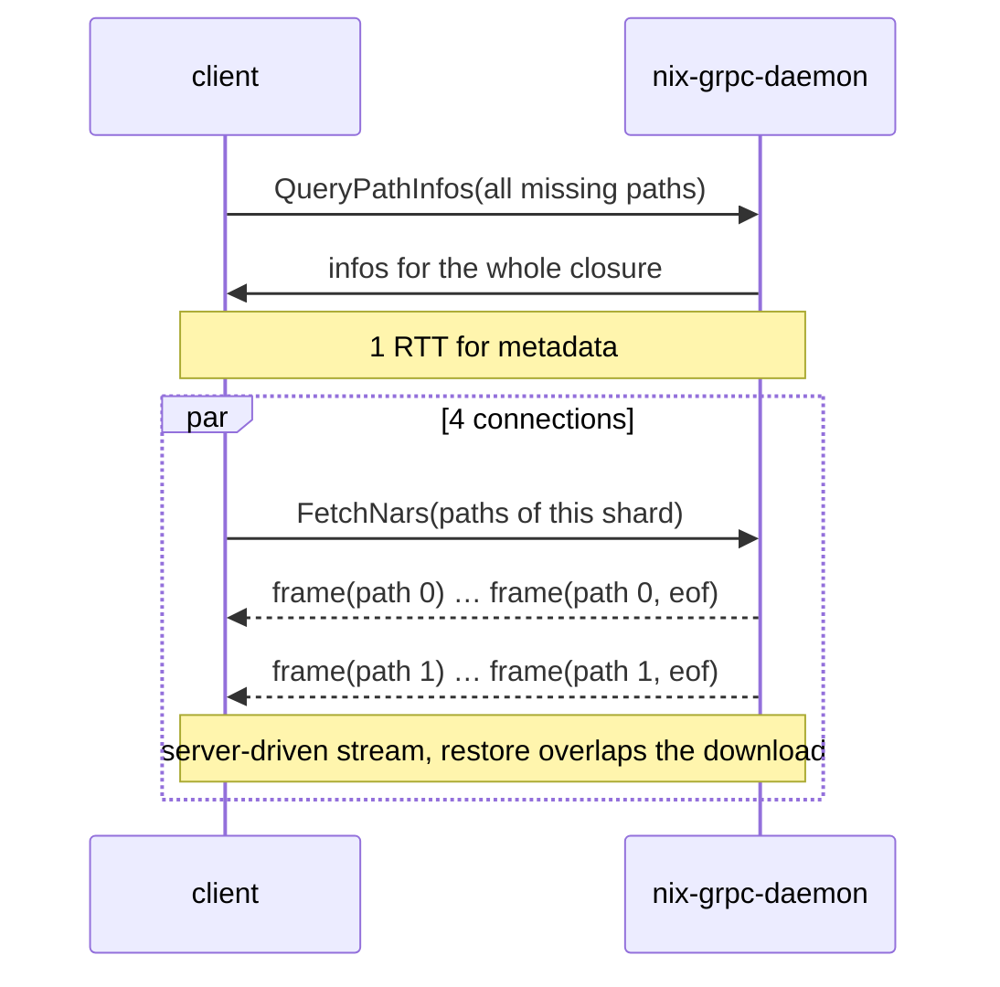
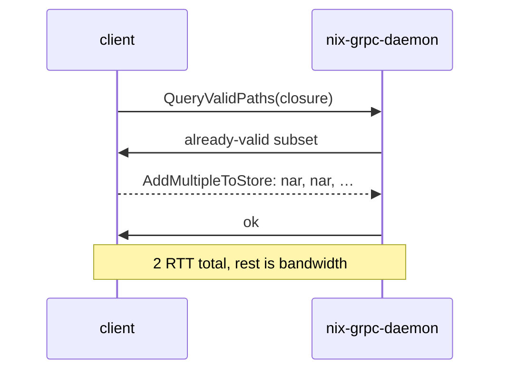
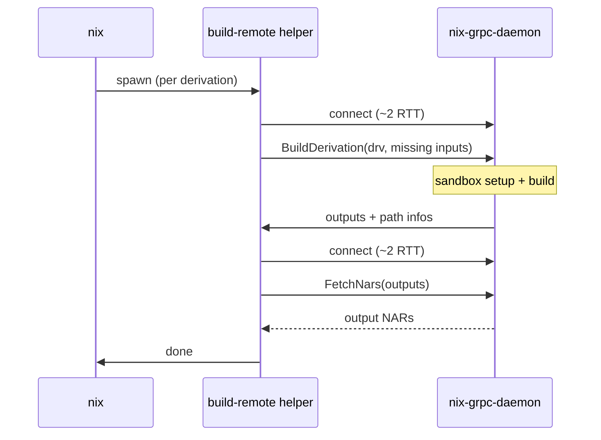
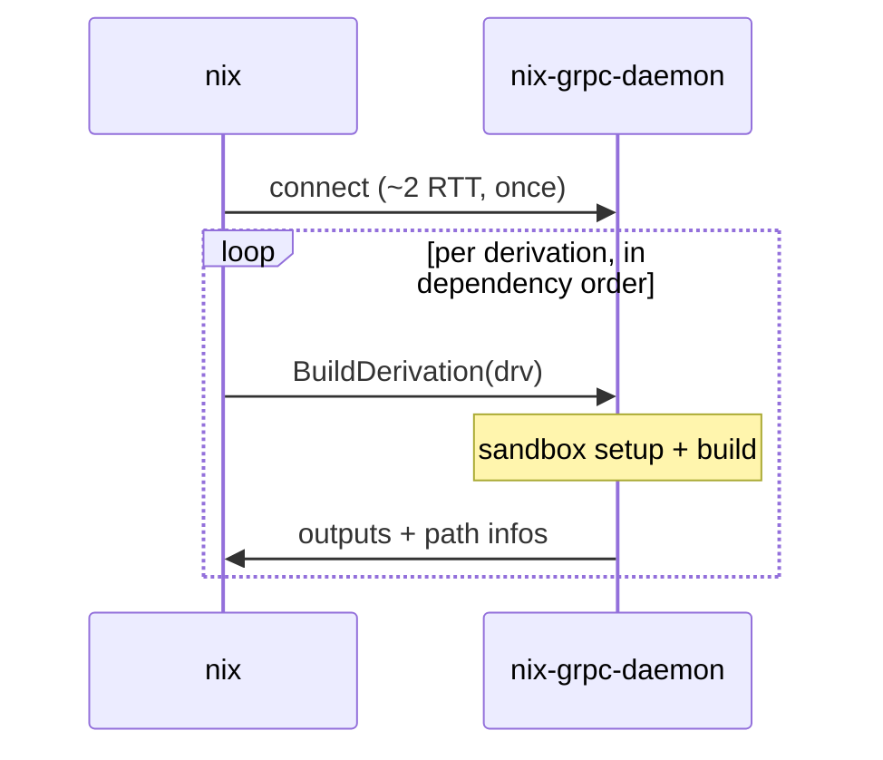

# Protocol latency

Round trips per operation. Every arrow pair that must complete before
the next step costs one RTT (~50 ms on the benchmark link).

A fresh connection costs about 2 RTT (TCP, TLS 1.3, HTTP/2 preface).
Channels are long-lived, so most operations pay this once.

## Substitution (`nix copy --from grpc://…`)

One batched RPC fetches path infos for the whole closure. Downloads
use one `FetchNars` stream per TCP connection (default 4). The client
sends the paths of each shard once and the server streams zstd frames
tagged with a path index. There are no per-path round trips. NARs are
restored while later ones are still in flight.

Total: connection setup + 1 RTT + transfer time. `ssh-ng://` instead
queries and fetches each path in turn over a single channel and pays
round trips per path.

## Upload (`nix copy --to grpc://…`)

One `AddMultipleToStore` stream carries all NARs back to back. The
server answers once at the end.

## Remote build, hook mode (`builders = grpc://…`)

Nix spawns a `build-remote` helper for every derivation. Each helper
opens its own connections, so the connection setup is paid again and
again.

Per derivation: helper spawn + ~4 RTT of connection setup + 2 RPCs +
the build itself. `ssh-ng://` has the same shape. Each connect is a
full ssh session there, and the tunnelled worker protocol adds further
round trips.

## Remote build, direct mode (`nix build --store grpc://…`)

One client process drives the whole build graph over one channel.
There is no helper spawn and no reconnect. Outputs stay on the remote
store instead of being copied back.

Per derivation: 1 RTT + the build itself. What remains is the cost of
the build on the server, not the wire. This is why the transports
converge in this mode.
